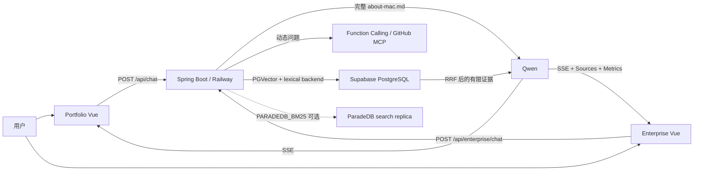
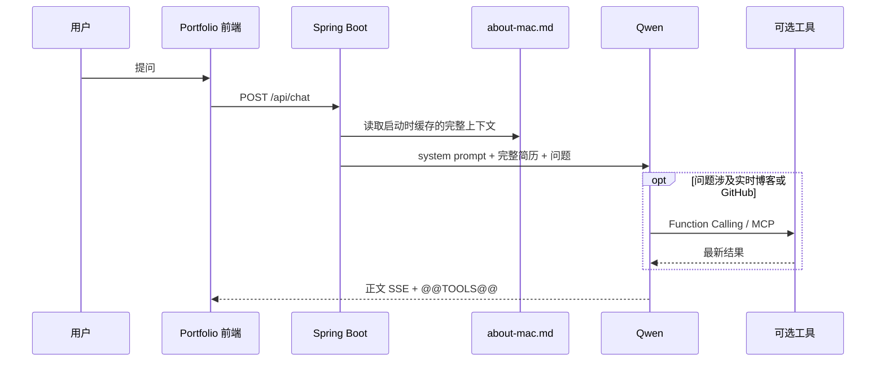
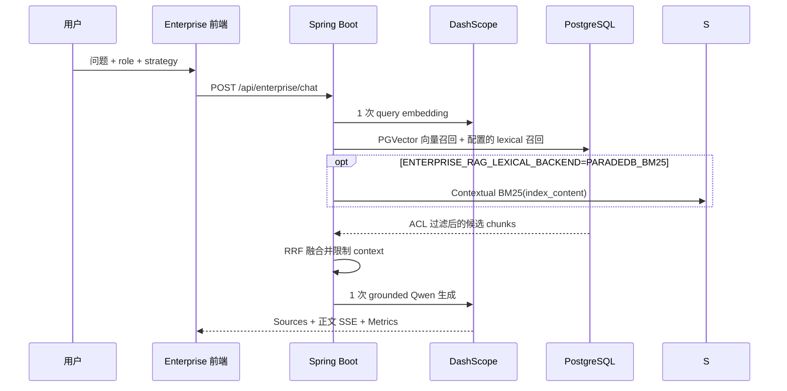
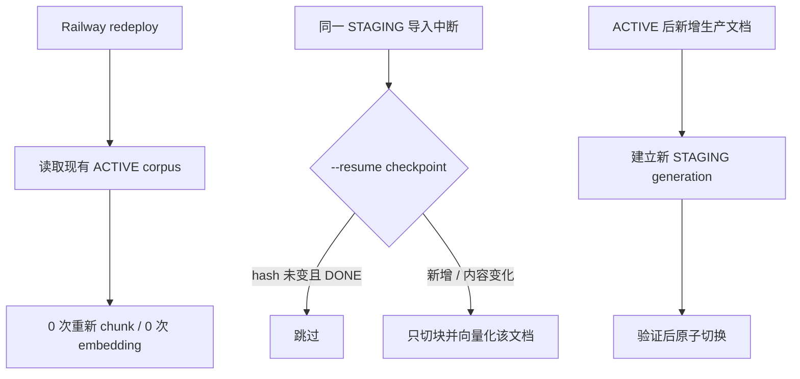

# Portfolio RAG / EnterpriseRAG

一个仓库、两条刻意分开的知识问答链路：

- **简历 AI Agent**：把完整 `about-mac.md` 作为静态上下文交给 Qwen；不查询向量库。博客和 GitHub 等动态信息才使用 Function Calling / MCP。
- **EnterpriseRAG**：对 EnterpriseRAG-Bench 文档做离线切块和向量化，使用可配置的 PostgreSQL FTS / ParadeDB BM25 + PGVector + RRF 检索，再让 Qwen 基于有限证据回答。

[EnterpriseRAG Live Site](https://enterprise-rag-frontend-seven.vercel.app/) · [个人主页](https://tmakerchima.cn/) · [GitHub](https://github.com/Tmakerchima/portfolio-rag)

## 当前生产状态

| 项目 | 当前值 |
|---|---:|
| Enterprise 文档 | 5,000 |
| Enterprise chunks | 15,816 |
| 已生成 embedding | 15,816 |
| Embedding | `text-embedding-v3`, 1,024 维 |
| Active corpus | `f5f1da84-145a-4688-bbb1-14bcdf354c9e` |
| 数据库 | Supabase PostgreSQL + pgvector |
| 后端 / 前端 | Railway / Vercel |

企业语料存放在 `enterprise_documents`、`enterprise_chunks` 和 `enterprise_corpora`；Supabase 中的旧 `vector_store` 不是 EnterpriseRAG-Bench 数据表。

## 架构



### 简历问答



这里没有 query embedding、PGVector 检索、RAG 标签或 Sources 面板。这样可避免只有一个来源时被 top-k 切块漏掉关键履历。`about-mac.md` 当前约 6,600 字符，仍需关注每次请求重复输入完整上下文的 token 成本。

### EnterpriseRAG 查询



## 5,000 文档如何切块

生产导入器是 [`eval/enterprise_rag_worker.py`](eval/enterprise_rag_worker.py)，默认策略为：

1. UTF-8 解码、统一换行并去掉首尾空白。
2. 使用 `tiktoken/cl100k_base` 计数，默认每段最多 **700 tokens**、同章节重叠 **80 tokens**。
3. 优先保留 Markdown 标题层级、段落、列表和 fenced code block；只有超长 block 才按 token 窗口切分。
4. `content` 保存可引用原文；`contextual_prefix` 保存可选 LLM 背景；`index_content` 同时用于 contextual embedding 与 lexical 检索（FTS fallback 或 ParadeDB BM25）。
5. Contextualizer 默认关闭；显式 `--contextual-enabled` 后每个 chunk 产生一次 chat 调用，失败默认停止以避免混合索引。
6. 文档和 chunk 使用 SHA-256 稳定标识；写库时一个文档一个事务，先替换该文档旧 chunks，再提交新版本。
7. 每批 embedding 最多 10 段，并用 pipeline fingerprint 阻止旧 checkpoint 混入新切块策略。

旧 `worker-v1` 基线的 5,000 篇文档得到 15,816 chunks、约 820 万输入 tokens；切换到 v2 后必须重新 dry-run/评测，不能把旧统计当作新方案结果。

## 为什么数据量一大就显得贵

- **Embedding 按输入 token 计费**，不是按 PostgreSQL 行数计费。原文、重叠文本和 contextual prefix 都会进入计费输入。
- **当前按文档批处理**：虽然单请求最多包含 10 个 inputs，但为了文档级事务和 checkpoint，没有跨文档凑满批次；这增加了 HTTP 请求数和耗时，不等于增加 token 单价。
- **向量有存储放大**：1,024 维 float32 原始向量约 4 KiB/chunk，15,816 条仅原始向量已约 62 MiB；正文、JSON 元数据、行开销、GIN/HNSW 索引还会继续放大。
- **在线问答仍有生成费用**：召回越多、context 越长，Qwen 输入越贵；因此 EnterpriseRAG 只给模型有限的 top-k 证据，不传整库。

按阿里云北京地域公开价估算，`text-embedding-v3` 同步调用为 **¥0.0005 / 千输入 tokens**，本批约 **¥4.10**；Batch API 公示价约为同步的一半，理论约 **¥2.05**。价格可能调整，请以 [DashScope Embedding 官方计费页](https://help.aliyun.com/en/model-studio/embedding) 为准。

## Redeploy、新文档与增量边界



- **部署代码不会重建语料**：Railway redeploy 或 JVM 重启的 Enterprise embedding 调用数是 0。
- **未完成任务可增量续跑**：保留原 SQLite checkpoint 和 corpus id，`--resume` 会根据 `external_id + content_hash` 跳过已完成且未变化的文档。
- **ACTIVE 后的生产更新目前采用 generation 隔离**：安全做法是写新 STAGING、验证、再原子激活；旧 generation 可用于回滚。
- **当前限制**：跨 generation 的 unchanged chunk copy-forward 尚未实现。因此 ACTIVE 后创建一个包含“旧数据 + 新文档”的新完整快照时，worker 仍可能重新 embedding 快照中的旧文档。下一阶段应实现 active-to-staging 内容哈希复制，只对新增、修改和删除 delta 做计算。
- 修改 chunk size、overlap、模型或向量维度时必须新建 generation，不能把不同向量空间混写。

## 每次调用多少次 API、大约多少钱

| 场景 | DashScope 调用 | 说明 |
|---|---:|---|
| Railway redeploy | 0 | 不启动 Enterprise worker |
| 简历静态问题 | 通常 1 | 一次 Qwen 生成；无 query embedding |
| 简历实时工具问题 | 通常 2+ 个模型回合 | 模型决定工具、工具返回后继续生成；另有 GitHub/博客外部请求 |
| Enterprise `HYBRID` 问题 | 2 | 一次 query embedding + 一次 Qwen 生成 |
| 5,000 文档旧 worker-v1 导入 | 5,000 embedding HTTP 请求 | 历史基线：15,816 inputs，约 820 万 tokens |
| v2 Contextual 入库 | embedding + 每 chunk 1 次 chat | 默认关闭；必须先做小样本成本/召回 A/B |

`qwen-plus` 北京地域公开价在不超过 128K 上下文档位为输入 **¥0.8 / 百万 tokens**、非思考输出 **¥2 / 百万 tokens**。简历约 2,000 输入 tokens，再生成 200–500 tokens 时，一次简单静态问答粗估约 **¥0.002–¥0.003**。Enterprise 单问成本取决于实际检索 context 和输出长度。请以响应中的 usage 和 [Qwen Plus 官方计费页](https://help.aliyun.com/zh/model-studio/qwen-plus) 为准，不要把这里的估算当账单。

## 项目结构

```text
portfolio-frontend/       个人主页 Vue 3 前端
enterprise-rag-frontend/ EnterpriseRAG 中英文前端
portfolio-rag/            Java 21 / Spring Boot / Spring AI 后端
eval/                     数据集下载、导入 worker、评估和 checkpoint
docs/                     架构、部署、容量、灾备与完整流程
```

## 本地开发

不要把密钥写入源码或前端变量。后端需要的核心环境变量：

```text
DASHSCOPE_API_KEY=<server-side secret>
SUPABASE_DB_PASSWORD=<server-side secret>
GITHUB_MCP_PAT=<optional server-side secret>
ENTERPRISE_RAG_ADMIN_TOKEN=<server-side secret>
ENTERPRISE_RAG_ACTIVE_CORPUS_ID=<validated corpus uuid>
```

```powershell
# 后端
cd portfolio-rag
mvn spring-boot:run

# 个人主页
cd ../portfolio-frontend
npm install
npm run dev

# Enterprise 前端
cd ../enterprise-rag-frontend
npm install
npm run dev
```

Vercel 的个人主页使用 `VITE_API_BASE`，Enterprise 前端使用 `VITE_API_BASE_URL`；两者都只配置公开后端 URL，不能配置数据库或模型密钥。Railway 运行共享 Spring Boot 后端，Supabase 保存持久数据，长时间导入任务由本地或受控 runner 执行。

## 成本优先的优化顺序

1. **记录真实 usage 和预算**：持久化 embedding/chat 输入输出 tokens、模型、请求类型与估算金额，设置日预算和告警。
2. **实现 generation delta/copy-forward**：按 `content_hash + chunker_version + embedding_model` 复用旧向量，只计算新增和变化内容。
3. **跨文档批处理或 Batch API**：把当前 5,000 次 embedding 请求接近压到 `ceil(15816/10)=1582` 次，或用离线 Batch API；同时保留幂等和文档级失败恢复。
4. **模型路由与缓存**：高频固定简历问题缓存答案；简单问题使用更便宜模型，复杂问题或工具调用再使用 qwen-plus。
5. **控制 prompt/context**：限制 Enterprise top-k 和最大上下文；`about-mac.md` 继续增长时，生成可审计的紧凑静态上下文，避免每问重复发送无关内容。
6. **避免无效 reranker 成本**：只有离线评估证明收益后才接付费 reranker；否则保留 RRF。
7. **数据库容量治理**：监控表、WAL、GIN/HNSW 和旧 generations；先保留可回滚版本，再按保留策略清理。量化或 `halfvec` 必须经过召回率与兼容性测试。
8. **生产防护**：收紧 CORS、增加限流/配额、管理接口鉴权、日志脱敏，以及问题级 tracing 和离线回归评估。

更完整的运行、降级、回滚和验收说明见 [`docs/enterprise-rag-end-to-end-flow.md`](docs/enterprise-rag-end-to-end-flow.md)；ParadeDB Contextual BM25 的配置、复制与 smoke test 见 [`docs/enterprise-contextual-bm25.md`](docs/enterprise-contextual-bm25.md)。

## 安全

仓库只应保存变量名和示例占位符。若任何真实数据库密码或 API Key 曾出现在聊天、日志、提交或截图中，应立即在对应平台轮换，并更新 Railway 的服务端环境变量。
