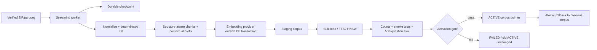
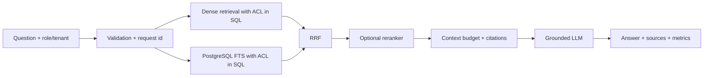

# EnterpriseRAG 500K architecture

This project has two deliberately separate knowledge paths:

1. Resume/Portfolio: `about-mac.md` is loaded once as a bounded, static context. It is not chunked, embedded, or deleted from `public.vector_store` at startup.
2. EnterpriseRAG-Bench: documents are loaded into a versioned staging corpus, embedded outside database transactions, validated, then atomically activated.

The design borrows public principles such as contextual chunk prefixes, lexical+dense retrieval, rank fusion, reranking and evaluation. It does not claim knowledge of any private ChatGPT or Anthropic implementation.

## Query path

The active corpus is selected inside SQL. A staging corpus is never sent to the application layer or LLM. Retrieval degrades from `PGVECTOR` to `FTS_ONLY`, and reranking/LLM failures return evidence or a retryable structured error instead of an invented answer.

## Blue/green lifecycle

`enterprise_corpora` is the control plane. A generation moves through `STAGING → EMBEDDING → INDEXING → VALIDATING → READY → ACTIVE`. `activate_corpus` retires the old pointer in one transaction. Rollback changes the pointer and retains both generations; it does not delete rows.

The V2/V3 migrations are additive and leave the legacy `public.vector_store` untouched. V3 separates citable `content` from generated `contextual_prefix` and retrieval-only `index_content`. Full dense ingestion is gated by Supabase capacity, backup/PITR, embedding/contextualization budget and canary measurements. A 500K load is not run on the current Free project.

## Resume full-context path

`ResumeContextProvider` loads `classpath:knowledge/about-mac.md`, validates UTF-8/non-empty/size, and `RagService` sends the complete text inside `<resume_context>`. The markdown is untrusted data: its contents cannot override system/developer instructions or request secrets/tools.
