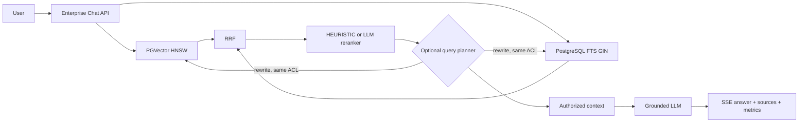
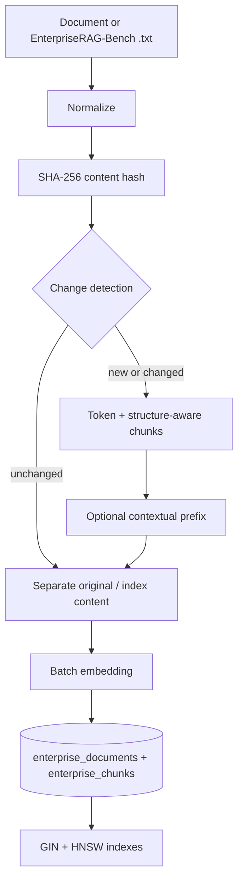
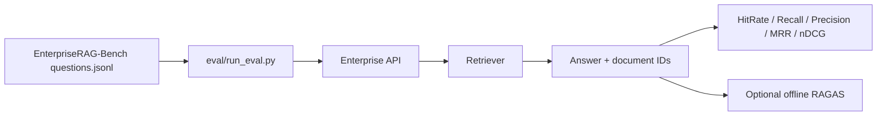

# EnterpriseRAG 架构

EnterpriseRAG 与 Portfolio AI Agent 共用一个 Spring Boot 后端，但使用独立的数据与服务边界。

Portfolio 知识库由少量 Markdown 文档组成，启动后进入内存 chunk store，默认使用词法 + metadata 意图检索并限制上下文；可选向量召回关闭时不会调用 query embedding。Enterprise 语料大且持续变化，使用增量索引、数据库检索和有限上下文：

> RAG is not automatically better for every corpus size.

## Query pipeline

ACL context（role、tenant、department）会进入 Vector/FTS SQL 的 where 条件，未授权文档不会先被召回再在 Java 中过滤。

## Ingestion

每个文档以 `source + external_id` 幂等 upsert；changed document 会在同一事务中替换 chunk，embedding 失败时不会先删除旧 chunk。Enterprise 不执行 `DELETE FROM vector_store`，也不会在应用启动时自动导入语料。

## Evaluation

评估只使用官方 `expected_doc_ids` 可支持的问题；没有 ground truth 的问题标记为 unsupported，不生成示例分数。RAGAS 只在 `eval/` 中运行，不进入线上请求链路。
