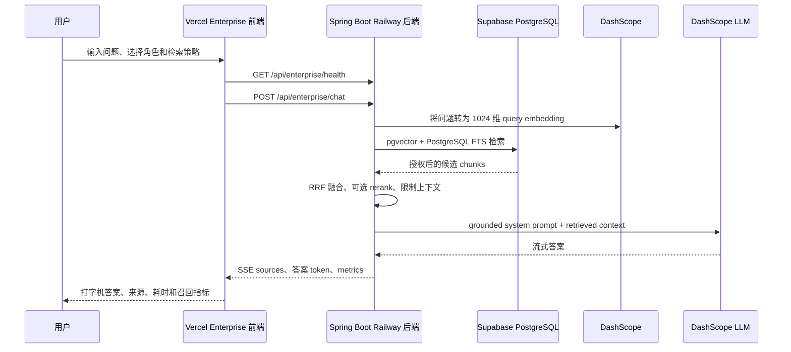
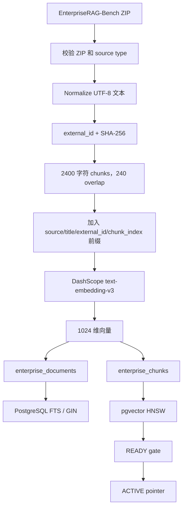

# EnterpriseRAG 端到端流程

本文描述当前项目从用户打开 Vercel 页面、发起问题，到 Spring Boot 检索、DashScope 向量化、PostgreSQL/pgvector 检索、LLM 生成和 SSE 返回的完整链路。

## 0. 当前生产状态

当前 EnterpriseRAG-Bench GitHub source slice 已完成 5,000 篇文档导入：

| 指标 | 当前值 |
|---|---:|
| Active corpus | `f5f1da84-145a-4688-bbb1-14bcdf354c9e` |
| documents | 5,000 |
| chunks | 15,816 |
| embedded chunks | 15,816 |
| embedding model | `text-embedding-v3` |
| vector dimension | 1,024 |
| database | Supabase PostgreSQL + pgvector |
| source | `EnterpriseRAG-Bench/github_slice_0001.zip` |

旧的个人简历 `about-mac.md` 使用原有 `vector_store`；EnterpriseRAG 使用独立的 `enterprise_documents` 和 `enterprise_chunks`，两条链路互不清空或覆盖。

## 1. 用户调用流程



### 1.1 前端启动

前端项目是 `enterprise-rag-frontend`，Vercel 环境变量为：

```text
VITE_API_BASE_URL=https://api.tmakerchima.cn
```

页面加载时调用：

```http
GET /api/enterprise/health
Accept: application/json
```

只有返回 `status=READY` 或 `status=DEGRADED` 时，前端才允许提问；页面同时显示 documents、chunks、embedded chunks、embedding model 和 vector backend。

### 1.2 用户问题接口

请求：

```http
POST /api/enterprise/chat
Content-Type: application/json
Accept: text/event-stream
```

请求体：

```json
{
  "question": "What are the default limits for multipart uploads?",
  "role": "engineering",
  "tenantId": "default",
  "strategy": "HYBRID"
}
```

字段说明：

| 字段 | 可选值 | 作用 |
|---|---|---|
| `question` | 非空字符串 | 用户问题 |
| `role` | `public`、`engineering`、`finance`、`hr`、`admin` | 生成 department/access ACL |
| `tenantId` | 租户字符串，可省略 | 限制 `tenant_id`；非 admin 默认使用 `default` |
| `strategy` | `VECTOR`、`KEYWORD`、`HYBRID`、`HYBRID_RERANK` | 选择检索策略；默认 `HYBRID` |

PowerShell 调用示例：

```powershell
$body = @{
  question = "What are the default limits for multipart uploads?"
  role = "engineering"
  tenantId = "default"
  strategy = "HYBRID"
} | ConvertTo-Json -Compress

Invoke-WebRequest `
  -Uri "https://api.tmakerchima.cn/api/enterprise/chat" `
  -Method POST `
  -ContentType "application/json" `
  -Headers @{ Accept = "text/event-stream" } `
  -Body $body
```

### 1.3 SSE 响应协议

后端返回 `text/event-stream`。前端按空行拆分事件，再解析每个 `data:` 行：

```text
data:@@SOURCES@@{...}

data:The

data: default limits are ...

data:@@METRICS@@{...}
```

三类帧：

| 帧 | 含义 |
|---|---|
| `@@SOURCES@@` | 检索到的来源、document id、chunk id、rank 和 score |
| 无 marker 的文本 | LLM 流式答案 token，前端直接追加渲染 |
| `@@METRICS@@` | vector、FTS、RRF、rerank、LLM、total latency 和 context 数量 |
| `@@ERROR@@` | 后端拒答、RAG disabled、请求为空或 LLM 失败 |

前端不会把来源假设成答案，而是把 evidence 单独展示，让用户可以检查答案依据。

## 2. 文档入库和向量化流程



### 2.1 Worker 的职责

完整规模导入使用：

```text
eval/enterprise_rag_worker.py
```

worker 不调用受限的 HTTP canary ingestion，而是直接使用受控数据库连接：

1. 拒绝 `.partial`、`.range*` 或损坏 ZIP。
2. 读取 ZIP 内的 `.txt` 文件，规范化换行和 UTF-8。
3. 使用 `source + external_id` 生成稳定文档身份。
4. 使用 SHA-256 进行变化检测和幂等恢复。
5. 按段落切分；当前 2,400 字符、240 字符 overlap。
6. 每批最多发送 10 条文本到 `text-embedding-v3`，生成 1,024 维向量。
7. 在单文档事务中 upsert document、替换该文档 chunks。
8. 把 `processed` 状态写入本地 SQLite checkpoint。
9. 每个文档更新 `enterprise_ingestion_jobs` 的进度。
10. 全部成功后把 corpus 从 `STAGING` 更新为 `READY`。

当前 5,000 文档 dry-run 的预期结果是 15,816 chunks；本次生产校验结果为 5,000 documents、15,816 chunks、15,816 embedded chunks。

### 2.2 数据表职责

| 表 | 职责 |
|---|---|
| `enterprise_corpora` | 数据集版本、embedding 配置、状态和汇总计数 |
| `enterprise_ingestion_jobs` | 导入 job、checkpoint cursor、处理数量、失败码 |
| `enterprise_documents` | 原始文本、source、title、tenant、department、access level |
| `enterprise_chunks` | 切片文本、chunk index、metadata、embedding、FTS search vector |
| `vector_store` | 旧的个人简历 RAG，EnterpriseRAG 不使用 |

## 3. 在线 RAG 检索流程

### 3.1 访问上下文和 ACL

后端先将 `role` 和 `tenantId` 规范化：

- `engineering` 映射到 `department=engineering`。
- `finance` 映射到 `department=finance`。
- `hr` 映射到 `department=hr`。
- `public` 只能看到 public 数据。
- `admin` 可以跨 department 访问授权 demo 数据。
- 非 admin 且没有传 `tenantId` 时，租户默认为 `default`。

ACL 在 PostgreSQL 的 vector/FTS SQL `WHERE` 条件中执行，先过滤授权范围，再参与排序；不是召回后再在 Java 层过滤。

### 3.2 两路召回

**Vector 召回**：

1. 使用同一个 `text-embedding-v3` 将用户问题转成 1,024 维 query vector。
2. 查询 active corpus 的 `enterprise_chunks.embedding`。
3. 使用 cosine distance 和相似度阈值，默认 `0.20`。
4. 默认取 vector top 12。

**Keyword 召回**：

1. 使用 PostgreSQL `websearch_to_tsquery('simple', ?)`。
2. 查询 `search_vector` GIN 索引。
3. 使用 `ts_rank_cd` 排序。
4. 默认取 keyword top 12。

### 3.3 RRF、rerank 和上下文压缩

`HYBRID` 将两路结果交给 Reciprocal Rank Fusion：

```text
rrf_score = Σ 1 / (rrf_k + rank + 1)
rrf_k = 60
```

融合后保留最多 `final_top_k * 3` 个候选，再截取最多 5 个最终 chunks；总上下文默认不超过 9,000 字符。

`HYBRID_RERANK` 保留 reranker 插槽；当前项目中的 `NoOpReranker` 不调用额外模型，失败时直接回退到 RRF 结果。

### 3.4 Grounded generation

后端向 LLM 发送：

```text
System:
  只能依据 retrieved enterprise context 回答。
  证据不足时必须明确说证据不足。
  不得编造权限、人员、日期、指标或公司事实。

User:
  Authorization role
  <context> 检索到的 chunks </context>
  User question
```

当前 `application.yml` 使用 DashScope OpenAI-compatible ChatClient，LLM 为 `qwen-plus`；embedding 为 `text-embedding-v3`。Enterprise Chat 只把授权后的 enterprise context 交给 grounded prompt，不把完整 5,000 文档传给 LLM。

## 4. 故障降级和回滚

### 4.1 在线检索降级

| 故障 | 行为 |
|---|---|
| Vector embedding/PGVector 失败 | 继续使用 FTS，metrics 标记 `FTS_ONLY` |
| PostgreSQL FTS 失败 | 继续使用 vector，metrics 标记 `VECTOR_ONLY` |
| reranker 失败 | 使用 RRF 结果，metrics 标记 `RRF` |
| vector 和 FTS 都失败 | 不伪造答案，使用 evidence-only / insufficient evidence |
| LLM 失败 | 返回 `@@ERROR@@`，前端显示请求错误 |
| health 非 READY | 前端禁止提交查询，显示 migration/ingesting/unavailable 状态 |

### 4.2 导入失败

导入始终先写新 corpus 的 `STAGING` 状态。embedding 欠费、网络超时、数据库断开时：

- 已提交文档事务保留。
- 当前文档失败不会先删除旧 chunks。
- SQLite checkpoint 记录 DONE/FAILED。
- 使用 `--resume` 从同一个 corpus 和 job 继续。
- 失败的 STAGING/FAILED corpus 不应直接激活。

### 4.3 蓝绿激活和 rollback

只有满足以下条件才激活：

```text
state = READY
document_count = expected_documents
chunk_count = embedded_chunk_count
embedding dimension 与线上配置一致
```

激活是 pointer/state 切换，不删除 document/chunk 行：

```http
POST /api/enterprise/admin/corpora/{corpusId}/activate
X-Enterprise-Admin-Token: <server-only-token>
```

回滚到已验证 corpus：

```http
POST /api/enterprise/admin/corpora/{corpusId}/rollback
X-Enterprise-Admin-Token: <server-only-token>
```

`ENTERPRISE_RAG_ADMIN_TOKEN` 只能配置在 Railway 后端或受控 runner，不能放在 Vercel 前端。`/api/enterprise/admin/ingest` 只适合小规模 canary；5,000 及以上使用 worker。

## 5. 评估流程

离线问题集位于：

```text
eval/data/EnterpriseRAG-Bench/questions.jsonl
```

评估链路：

```mermaid
flowchart LR
    Q[questions.jsonl] --> R[eval/run_eval.py]
    R --> A[/api/enterprise/chat]
    A --> S[SOURCES frame]
    S --> E[retrieval_eval.py]
    E --> M[HitRate Recall Precision MRR nDCG]
    A --> G[Optional RAGAS]
```

建议至少分别跑 `VECTOR`、`KEYWORD`、`HYBRID`，比较 HitRate@K、Recall@K、MRR 和 nDCG。没有 `expected_doc_ids` 的问题必须标记 unsupported，不生成虚假 ground truth 分数。

## 6. 生产配置清单

Railway 后端需要配置：

```text
SUPABASE_DB_PASSWORD=<server-only>
DASHSCOPE_API_KEY=<server-only>
ENTERPRISE_RAG_ENABLED=true
ENTERPRISE_RAG_VECTOR_BACKEND=PGVECTOR
ENTERPRISE_RAG_EMBEDDING_MODEL=text-embedding-v3
ENTERPRISE_RAG_EMBEDDING_DIMENSIONS=1024
ENTERPRISE_RAG_STRATEGY=HYBRID
ENTERPRISE_RAG_VECTOR_TOP_K=12
ENTERPRISE_RAG_KEYWORD_TOP_K=12
ENTERPRISE_RAG_FINAL_TOP_K=5
ENTERPRISE_RAG_RRF_K=60
ENTERPRISE_RAG_MAX_CONTEXT_CHARS=9000
ENTERPRISE_RAG_SIMILARITY_THRESHOLD=0.20
ENTERPRISE_RAG_ADMIN_TOKEN=<独立随机 token>
```

Vercel 前端只需要：

```text
VITE_API_BASE_URL=https://api.tmakerchima.cn
```

数据库密码、DashScope key、admin token、GitHub PAT 都不能进入前端、Git、日志或 manifest。

## 7. 快速验收清单

```text
GET  /api/enterprise/health                         -> READY
数据库 enterprise_corpora                         -> ACTIVE
documents                                          -> 5000
chunks                                             -> 15816
embedded_chunk_count                               -> 15816
POST /api/enterprise/chat                          -> HTTP 200
SSE 中存在 @@SOURCES@@ 和 @@METRICS@@              -> 是
旧 public.vector_store                              -> 未被 Enterprise 导入清空
```

当前已验证问题：`What are the default limits for multipart uploads?`。生产返回 HTTP 200，并返回了 multipart 相关来源、流式答案和 vector/FTS/RRF/LLM metrics。
